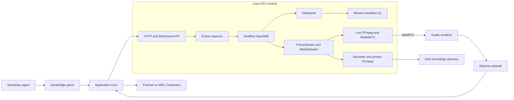

# Runtime and Desktop architecture

AstraBridge consists of one Linux x86_64 OCI runtime and one Desktop/CLI
application. The runtime image contains modified OpenMW, the Python daemon and
Lua mod, Weston, XWayland, Mesa/VAAPI components, pinned FFmpeg and MediaMTX.
Game data and persistent state are supplied separately.

## Components

Linux uses rootless Podman. Windows uses WSL Containers directly through
`wslc.exe`; there is no Docker Desktop, nested Podman or user-installed Linux
distribution.

The same image is used on both platforms. Linux exposes render nodes or NVIDIA
CDI devices. WSL exposes its GPU integration, with Mesa D3D12 as the intended
graphics/video path. Userspace Mesa and VAAPI libraries are part of the image;
the host supplies kernel/device access and required proprietary driver components.

## Lifecycle and storage

Install creates managed state and a persistent container. Game data use a
read-only host-folder mount by default; the user can instead request a managed
copy in a separate game volume. Ordinary
start/stop/restart retains the container ID. Updates explicitly recreate the
container around the existing volumes. Closing Desktop disconnects the viewer
and releases manual input; it does not stop an agent, recording or runtime.

The daemon can run while the game is stopped. This permits configuration,
recording browsing and retained Atlas queries without launching OpenMW.

| Data | Storage |
|---|---|
| OpenMW, daemon, Lua, media programs and libraries | Immutable OCI image |
| Game directory | Read-only host-folder mount by default, or an optional managed game copy |
| Profiles, saves, Atlas, knowledge and session state | Managed state volume |
| Transport buffers and screenshots | Runtime directory in the state volume |
| MP4 recordings and their sidecars | User-selected host directory, mounted at `/data/recordings` |
| Desktop connection settings and agent session token | Host application configuration |

The optional game import copies the selected directory without analyzing game records,
detecting an edition/language, deduplicating content or rewriting its structure.
Filesystem links escaping the imported tree are rejected. The user explicitly
chooses the encoding and data subdirectory. `Morrowind.ini` supplies active
content order and archives; these can be edited before starting the game.
The existing Tribunal addon generator separately reads its effective script
during runtime profile preparation.

## Ownership and pause behavior

There is one input owner: idle, manual or agent. The daemon enforces this rule;
disabling a Desktop button is not the enforcement mechanism.

- `agent connect` reserves control across short CLI invocations, with no thinking
  timeout. A second agent is rejected. A deliberate user action can end a stale
  session; ordinary manual input cannot take over an active agent.
- Agent actions retain their existing finite execution and pause boundaries.
  Disconnect interrupts an active action, clears input and leaves the game paused.
- Manual control releases AstraBridge's movement override and pause tag. The
  game's own controls, collision and modal behavior still apply. Pointer Lock
  supplies relative camera movement; UI pointer coordinates account for scaling.
- Losing a manual connection releases held keys/buttons and pauses the game.
  Daemon restarts invalidate previous ownership tokens.

The gameplay CLI and live viewer are independent. A user may watch an agent
without obtaining input ownership.

## Transport and boundaries

The daemon exposes [Game and Runtime APIs](runtime-api.md). Host ports are bound
to loopback; the server listens on the container interface so port forwarding
can reach it. WebRTC uses its own ICE/TCP media port. Internal RTSP and MediaMTX
management/signaling listeners remain private to the container and are mediated
by the daemon.

Local API requests require an installation token. Game requests additionally
require the current agent session token. Private Lua transport arguments are
not public Game API parameters. Screenshots/maps are transferred as artifacts;
clients do not open private databases or buffer files.

Production does not require privileged containers, a runtime socket inside the
image, host PID namespace or the host display server. Its filesystem binds are
the selected recordings output directory and, when requested, the read-only
game directory. Development may explicitly bind
source, game and build directories.

This is not an agent sandbox. A host user who owns Podman and the application
configuration can manage its containers and files. Stronger host access rules
are the responsibility of the deployment environment. Production additionally
disables the in-game console at the engine level; ordinary mouse/keyboard input
continues to work.

## Media and release identity

Both recording and live video consume completed engine frames and native audio.
The viewer uses a wall-clock transport with waiting frames/silence; it never
advances the engine sample clock. Benchmark recording uses the engine timeline
and excludes thinking pauses. See [recording and live media](recording.md).

A Desktop release identifies a specific image digest, API versions, native
engine and FFmpeg build. Updates are explicit. Users install the new Desktop
package and then update its runtime. Prior state is snapshotted before migration;
failed updates preserve the previous image and a restore path. There is no
automatic migration from the old portable-bundle installation format.

### Virtual input seat

The image uses Weston 13 with `runtime/graphics/virtual-seat.c`, a small module
built against the image's libweston ABI. It creates a virtual keyboard/pointer
seat for the headless backend so XWayland keeps focus and accepts manual input.
It opens no host input devices and requires no `/dev/input` or host display mount.
The daemon sends validated XTest events to the private XWayland server.
