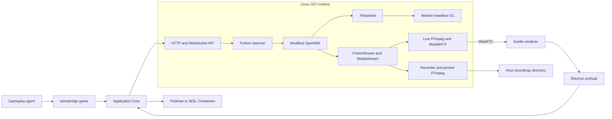

# Runtime and Desktop architecture

AstraBridge consists of one Linux x86_64 OCI runtime and one Desktop/CLI
application. The runtime image contains modified OpenMW, the Python daemon and
Lua mod, Weston, XWayland, Mesa/VAAPI components, pinned FFmpeg and MediaMTX.
Game data and persistent state are supplied separately.

The Windows application is a portable ZIP with Electron, resources and the
`astrabridge.exe` launcher. It opens the GUI without arguments and invokes CLI
mode with commands. Application configuration and runtime data live outside the
extracted application folder, so replacing that folder preserves them. Runtime
image installation and updates remain explicit application operations.

## Components

Linux uses rootless Podman. Windows uses WSL Containers directly through
`wslc.exe`; there is no Docker Desktop, nested Podman or user-installed Linux
distribution.

The same image is used on both platforms. Linux exposes render nodes or NVIDIA
CDI devices. WSL exposes its GPU integration, with Mesa D3D12 as the intended
graphics/video path. Userspace Mesa and VAAPI libraries are part of the image;
the host supplies kernel/device access and required proprietary driver components.

## Lifecycle and storage

Install creates managed state and a persistent container. Game data use a
read-only host-folder mount by default; the user can instead request a managed
copy in a separate game volume. Ordinary
start/stop/restart retains the container ID. Updates explicitly recreate the
container around the existing volumes. When closing Desktop with a running container, the user chooses **Keep running**,
**Stop runtime**, or **Cancel**. Keeping it running disconnects the viewer and
releases manual input while retaining the agent and recording session. Stopping
waits for engine shutdown and recording finalization before closing the window;
it does not create a game save. A failed stop keeps Desktop open with an error.

Setup provides **Remove container** with a separate confirmation. It stops a
running runtime and removes only the container; named volumes, game files,
recordings and connection configuration are preserved. **Recreate container**
creates the matching runtime around those same data. This is not a data reset
or an uninstall of the user's game.

The daemon can run while the game is stopped. This permits configuration,
recording browsing and retained Atlas queries without launching OpenMW.

| Data | Storage |
|---|---|
| OpenMW, daemon, Lua, media programs and libraries | Immutable OCI image |
| Game directory | Read-only host-folder mount by default, or an optional managed game copy |
| Profiles, saves, Atlas, knowledge and session state | Managed state volume |
| Transport buffers and screenshots | Runtime directory in the state volume |
| MP4 recordings and their sidecars | User-selected host directory, mounted at `/data/recordings` |
| Desktop connection settings and agent session token | Host application configuration |

The optional game import copies the selected directory without analyzing game records,
detecting an edition/language, deduplicating content or rewriting its structure.
Filesystem links escaping the imported tree are rejected. The user explicitly
chooses the game language. Desktop maps it to the supported text encoding and
automatically locates `Data Files` (or a selected data folder). An advanced
subfolder override supports custom layouts. `Morrowind.ini` supplies active
content order and archives; these can be edited before starting the game.
The existing Tribunal addon generator separately reads its effective script
during runtime profile preparation.

## Playthrough profiles

Desktop's **Profiles** page creates, renames, selects, duplicates and permanently
deletes profiles. Every management operation requires OpenMW to be stopped; the
daemon enforces this under the same lifecycle lock used for game startup. The
container may keep running. Deletion has a separate confirmation and no trash.
Deleting the active profile selects another; deleting the last one creates an
empty default profile. Host video files and shared game assets are retained.

Each profile owns its saves, game settings, Atlas, recognized objects, knowledge,
notes, screenshot attachments, session history and action receipts. There is no
shared knowledge database. Creating a profile copies configuration only;
**Duplicate profile** copies persistent data into independent files/databases
and rebases attached screenshot paths. It does not copy existing video files,
engine transport buffers or caches. Deleting or editing the source cannot change
the duplicate. The game installation and OCI image are shared.

`/data/profiles.json` holds the active ID and profile names. New profiles live in
`/data/profiles/<id>`. Existing flat state is registered as **Default** without
moving saves. Recordings use `<host recordings folder>/<profile id>`; the legacy
Default retains its original top-level recording files. The recording browser
can show all profiles or filter the selected profile; **Open folder** opens the
host recording root. Both work without starting the runtime. Switching clears in-memory
Atlas/artifact/replay caches and closes the previous session's databases.

Exported gameplay skills identify the application and configuration, not a
profile. `agent connect` uses the profile currently selected by the user.
An optional `--profile ID` is a mismatch guard, not a switching command.
Switching profiles does not require a new skill export. Updates snapshot the profile catalog and every profile, including
screenshots referenced by retained notes. Removing a container preserves them.

## Atlas viewer

Desktop reads retained travel data through the Runtime API. Its map contains the
same recorded paths, observed directions and visited points as travel memory;
it does not fill in unexplored terrain. The Desktop SVG omits the agent diagram's
embedded observation list because the interactive sidebar supplies those details.

The map keeps its height when selecting a point or viewing transitions. Its first
view and **Fit** frame the known route and current position with padding. Scroll
or use **+ / −** to zoom, and drag to pan. Keyboard users can focus the map and
use **+ / −**, arrow keys and **0** (Fit). Click a point or choose it from the
sidebar; **Locate on map** centres and highlights it. **Expand map** hides the
sidebar. **Area** selects the extent of retained data to request, while zoom only
changes its display. Transitions list known doors and their destination locations.
Changing the area/location refreshes the SVG even when its artifact ID is reused.

## Ownership and pause behavior

There is one input owner: idle, manual or agent. The daemon enforces this rule;
disabling a Desktop button is not the enforcement mechanism.

- `agent connect` reserves control across short CLI invocations, with no thinking
  timeout. A second agent is rejected. A deliberate user action can end a stale
  session; ordinary manual input cannot take over an active agent.
- Agent actions retain their existing finite execution and pause boundaries.
  Disconnect interrupts an active action, clears input and leaves the game paused.
- Manual control releases AstraBridge's movement override and pause tag. The
  game's own controls, collision and modal behavior still apply. Pointer Lock
  supplies relative camera movement; UI pointer coordinates account for scaling.
- Losing a manual connection releases held keys/buttons and pauses the game.
  Daemon restarts invalidate previous ownership tokens.

Desktop's Fullscreen button expands the viewer through the native window mode.
Use `Exit fullscreen` to return; the controls reappear when moving the pointer.
Escape is not assigned to exiting the viewer, so it retains its game behavior
and the browser's normal pointer-lock release behavior.

The **Play** screen gives the remaining window space to the game, preserving its
aspect ratio without page scrolling. Recording and fullscreen controls sit above
the picture alongside audio, manual input and a stable FPS indicator. Only
playback and the recording timeline remain below.
The mouse capture button enables relative camera movement during manual control.
**Viewer options** contains stream quality and disconnect; **Session** contains
runtime start/stop/restart, skill export and ending an agent session. These menus
overlay the viewer instead of reducing its size. Errors remain visible inside
fullscreen. The selected profile is shown as a noninteractive label. At narrow window widths, the navigation uses labeled icons
with hover titles.

The gameplay CLI and live viewer are independent. A user may watch an agent
without obtaining input ownership.

## Transport and boundaries

The daemon exposes [Game and Runtime APIs](runtime-api.md). Host ports are bound
to loopback; the server listens on the container interface so port forwarding
can reach it. WebRTC uses its own ICE/TCP media port. Internal RTSP and MediaMTX
management/signaling listeners remain private to the container and are mediated
by the daemon.

Local API requests require an installation token. Game requests additionally
require the current agent session token. Private Lua transport arguments are
not public Game API parameters. Screenshots/maps are transferred as artifacts;
clients do not open private databases or buffer files.

Production does not require privileged containers, a runtime socket inside the
image, host PID namespace or the host display server. Its filesystem binds are
the selected recordings output directory and, when requested, the read-only
game directory. Development may explicitly bind
source, game and build directories.

This is not an agent sandbox. A host user who owns Podman and the application
configuration can manage its containers and files. Stronger host access rules
are the responsibility of the deployment environment. Production additionally
disables the in-game console at the engine level; ordinary mouse/keyboard input
continues to work.

## Media and release identity

Both recording and live video consume completed engine frames and native audio.
The viewer uses a wall-clock transport with waiting frames/silence; it never
advances the engine sample clock. Benchmark recording uses the engine timeline
and excludes thinking pauses. See [recording and live media](recording.md).

A Desktop release identifies a specific image digest, API versions, native
engine and FFmpeg build. Updates are explicit. Users install the new Desktop
package and then update its runtime. The new image is downloaded while the old container remains available. Applying
an update requires the agent to disconnect and stops the game/recording before
copying profile, saves, Atlas, notes and session state. The old container is
replaced with one using the same persistent volumes and host mounts. A readiness
or startup failure restores the previous data and runtime.

Update progress is recorded in the private installation configuration before
replacement. If Desktop exits unexpectedly, Setup offers **Recover interrupted
update**; normal startup is blocked until recovery completes. Container-running
and game-running state are preserved separately. Updates do not make a game save.

After a successful update, one previous image and one complete update snapshot
remain for recovery. Only older update snapshots and runtime images retired by
this installation are candidates for cleanup. Manual backups, game data and
recordings are excluded. Image removal is never forced; resources still in use
or temporarily unavailable for cleanup are retried later. An older Desktop may
not implicitly downgrade an installed runtime or its data. There is no
automatic migration from the old portable-bundle installation format.

### Virtual input seat

The image uses Weston 13 with `runtime/graphics/virtual-seat.c`, a small module
built against the image's libweston ABI. It creates a virtual keyboard/pointer
seat for the headless backend so XWayland keeps focus and accepts manual input.
It opens no host input devices and requires no `/dev/input` or host display mount.
The daemon sends validated XTest events to the private XWayland server.
