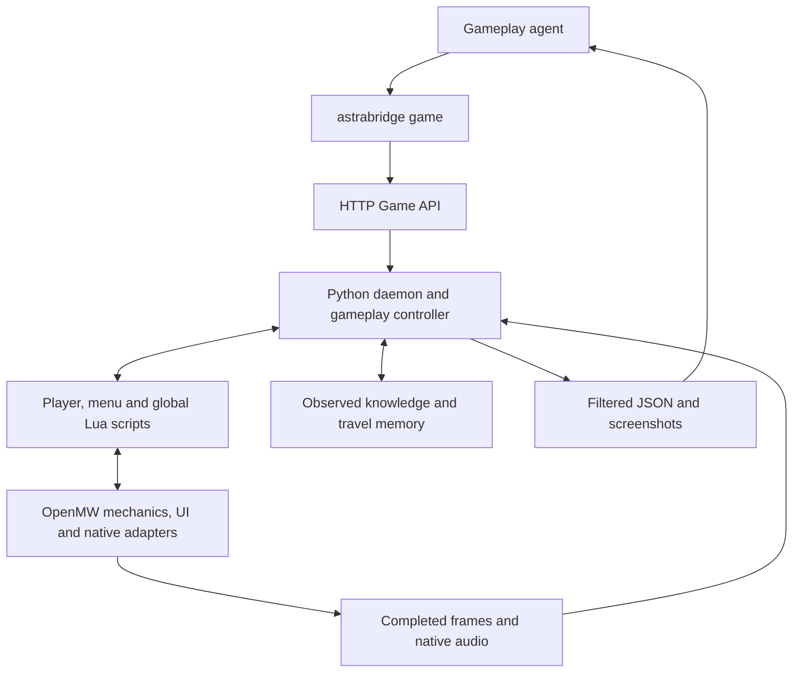

# OpenMW modifications

## Baseline and build path

The native engine is based on upstream **OpenMW 0.51.0**. Its checked-in source
is in [openmw-source/openmw-openmw-0.51.0](../openmw-source/openmw-openmw-0.51.0/).
The upstream reference is the
[openmw-0.51.0 tag archive](https://codeload.github.com/OpenMW/openmw/tar.gz/refs/tags/openmw-0.51.0).

There are **36 modified existing files and four added native headers**, apart
from omitted upstream documentation and development-support files. The patch
recipe is designed to be idempotent and the vendored tree includes these changes.

The release builder copies the tracked source into its work directory and runs
[runtime/native/patch_engine.py](../runtime/native/patch_engine.py). That recipe
records the intended edits and checks its expected source anchors. The adapter
headers in [runtime/native](../runtime/native/) are the maintained copies that
the recipe installs into the engine tree. Both the vendored changes and these
headers matter when reviewing or updating the engine.

The [build entry point](../runtime/native/build_engine.py) compiles the patched
OpenMW player. Release packaging, verified engine reuse and compiler caching
are described in [development and builds](development.md).

## Where the responsibilities live

The C++ additions expose UI state, normal input actions, a few player/motor
facts, pause control and audiovisual capture. Lua implements movement and
visibility policy. Python owns command execution, validation, persistence and
recording. Native bindings are internal adapters, not the public agent API.
In particular, not every native binding independently enforces every
visibility or distance rule; the Lua/Python projection is part of the boundary.

## 1. Access to existing game UI

**Purpose:** expose meaningful controls without making the agent reconstruct
every UI action from pixels and pointer movements.

[astraui.hpp](../runtime/native/astraui.hpp) traverses the current MyGUI UI and
produces text, roles, enabled/selected state, item information and control
handles. Selection invokes existing widget callbacks. Edits and slider changes
also go through the corresponding game controls. The adapter does not replace
barter, training, repair, travel or other service rules with direct state edits.

Small additions to UI construction preserve semantics that would otherwise be
lost in a generic widget tree:

- Stable control names for rest, quantity dialogs, barter, travel and NPC services.
- Localized destination labels and the displayed trade balance.
- Availability reasons already determined by training/spell-buying menus.
- Semantic codes for ordinary success/failure notifications, without parsing
  their translated wording in Python.
- Captions/state for skill, attribute, spell and ingredient-effect widgets;
  undiscovered ingredient effects remain `?`.
- Identification of the top modal, so an underlying window is not treated as
  actionable while a confirmation or tutorial prompt blocks it.

The adapter can enumerate populated rows of an open list or item view beyond
its current scroll position. It reports whether an entry is on screen; an
offscreen row does not gain a fictitious pixel rectangle. Item details come
from the active UI model, including filtered and proposed-trade views, rather
than an arbitrary NPC's inventory.

Control identities follow menu meaning and state. Tooltip appearance, fading
notifications or scrolling alone need not invalidate an unchanged action.
Selection is revalidated against a fresh snapshot before the callback runs.
Console and postprocessing/debug UI are excluded.

### Open documents and dialogue

The book-page widget exposes formatted text runs and existing link callbacks.
Book and scroll windows label the currently opened document with an instance
identity. Reading uses that formatted document, with bounded text chunks and
stale-reference checks; it does not query unopened book records. The duplicate
right-page representation of a book is not returned as a second copy.

Dialogue access exposes the current conversation/history and populated topic
and service controls. It does not look up the response to a topic that has not
been selected. Full open-document/list access is an accessibility choice,
broader than extracting only the current screenshot's pixels.

### Pointer integration

An `injectUiMouseMove` hook passes a resolved UI position through OpenMW's
mouse manager. Hover therefore uses the same GUI cursor and tooltip machinery
as normal interaction. Scrolling dispatches ordinary MyGUI wheel events and
respects the active modal.

## 2. Normal activation, player state and combat support

[uibindings.cpp](../openmw-source/openmw-openmw-0.51.0/apps/openmw/mwlua/uibindings.cpp)
registers private `_astra…` functions. Most player operations require a local
script in a synchronized update; UI observation/selection supports the
appropriate synchronized UI context.

Activation invokes the normal `A_Activate` action. When the caller supplies an
expected object, the binding first checks that it is the engine's actual focus
object. A nearby object is not substituted just to make an interaction succeed.
Rest similarly invokes the normal rest action and lets the game decide whether
the rest UI is available.

[astracombat.hpp](../runtime/native/astracombat.hpp) provides the player's current
weapon/tool, ammunition, selected spell/enchantment and resource availability.
Spell details are restricted to spells the player knows. Actor reach checks
use normal combat bounds and rules for a target already validated by Lua.

Projectile origin, speed, gravity and release strength support the motor's
aiming calculations. These are internal motor inputs; projectile world
coordinates are not serialized as a public observation. Attacks, casts and
their outcomes still pass through ordinary controls and game mechanics.

Owned-item inspection checks membership in the player's inventory before
returning tooltip/condition/effect data. The door/container description helper
returns the game's tooltip text; the public close-inspection gate is in Lua
and the Python recognition projection, not in that helper alone.

## 3. A stable pause boundary

The native `_astraPause` binding applies the same `AstraBridge` pause tag used
by the global Lua script and updates the engine's paused state immediately.
This lets the action controller stop the world within the synchronized frame,
before the engine samples pause state for world/mechanics updates.

The Lua action state machine releases held input, waits for the pause/settling
boundary and returns a stable result. The runtime also forces synchronous
physics in its private profile. That setting avoids committing a previous
physics frame only when the next command resumes the world. It is a profile
setting, not a replacement physics algorithm.

The native top-modal marker and UI snapshot allow Lua to interrupt an action
when a popup requires input even if the ordinary Lua UI mode still says
`Gameplay`. The `ui_input_required` action result and its propagation through
sequences are Lua/Python behavior built on this native UI information.

## 4. Completed-frame capture and synchronized audio

[astraframe.hpp](../runtime/native/astraframe.hpp) adds capture immediately before
`SDL_GL_SwapWindow`, after scene and HUD drawing. It reads the completed OpenGL
back buffer and publishes BGRA frames to a private memory-mapped ring. Sequence
checks prevent the Python reader from accepting a partially written or
overwritten frame. Capture is requested by the controller; this is not a
desktop screenshot hook.

[astramedia.hpp](../runtime/native/astramedia.hpp) owns a 48 kHz media clock and
PCM ring. It associates samples with the actual rendered frame number,
including when rendering is delayed relative to simulation. The clock advances
for active simulation and explicitly recorded UI interaction; reasoning pauses
do not add video time or consume game audio.

With Astra media transport enabled, the OpenAL backend uses synchronous
OpenAL Soft loopback mixing into stereo float PCM at 48 kHz. Streaming sounds
are refilled before mixing. An optional SDL audio device monitors those samples
for the user; inability to open speakers does not remove audio from a recording.
Normal audio-device handling remains available when the Astra transport is not
enabled.

H.264/AAC encoding, frame pacing, MP4 finalization and GPU/CPU FFmpeg selection
belong to Python. Automatic VAAPI/NVENC selection is **not an OpenMW encoder
patch**. The pinned image supplies encoder programs and userspace libraries;
host/runtime integration supplies GPU devices and required host drivers.

PCM production also has an independent subscriber flag in the shared media
header. A live viewer can receive audio before/after a recording without
changing recording start/end acknowledgements, frame flags or the engine clock.
The Python Recorder trims shared blocks to its own exact sample interval.

## 5. Explicit recovery

`_astraResetNPC` calls OpenMW's `resetActors()` implementation, corresponding
to RA/ResetActors. The public wrapper requires a reason and invalidates affected
handles/routes. It is the [documented emergency recovery exception](mods-and-fixes.md#explicit-npc-placement-recovery),
not a general movement operation or a generic console/evaluation interface.

## 6. Production console policy

`--disable-console` is a startup option carried by Engine into WindowManager
and Console. Their policy is fixed for the running instance. Production uses
this flag; development can retain the normal console.

The policy prevents opening the console, executing a command, reading/executing
a console command file and dispatching a console command into Lua. Combining it
with `--script-run` is rejected at startup. Blocking only the key binding would
leave alternative execution paths open, so checks exist at both UI and command
execution boundaries. Ordinary game scripts, UI input and the documented
ResetActors recovery adapter continue to work.

## Native binding inventory

All names below are internal members added to `openmw.ui`. Public commands are
documented in the [skill reference](../skill/references/commands.md).

| Bindings | Responsibility and boundary |
|---|---|
| `_astraUiSnapshot`, `_astraUiChoose` | Current game UI projection and revalidated control selection. |
| `_astraUiEdit`, `_astraUiAdjust` | Existing text inputs and sliders; respect enabled state and bounds. |
| `_astraUiHover`, `_astraUiScroll` | Native GUI pointer/wheel behavior and modal checks. |
| `_astraReadDocument` | Text of the currently opened formatted book/scroll. |
| `_astraOwnedItemInfo` | Player-owned inventory details and opaque item-instance identity. |
| `_astraDoorDescription` | Tooltip for a door/container; callers must apply the inspection gate. |
| `_astraIsActivationTarget`, `_astraActivate` | Actual focus-object check and ordinary activation. |
| `_astraRest` | Ordinary rest input action. |
| `_astraPlayerState` | Player animation/casting/sneaking/submersion state. |
| `_astraCombatInfo`, `_astraSpellInfo` | Own equipment/magic, known spells and availability. |
| `_astraTargetReach` | Melee/touch reach for a Lua-validated target. |
| `_astraProjectileParameters` | Private parameters for the player's current ranged attack. |
| `_astraPause` | Immediate application of AstraBridge's own pause tag. |
| `_astraResetNPC` | Explicit engine ResetActors recovery. |

## Complete changed-file inventory

Paths below are relative to the vendored OpenMW tree. The groups account for
all 35 modified files in the upstream comparison; helper headers are listed
separately afterward.

| Changed files | Purpose |
|---|---|
| [apps/openmw/mwlua/uibindings.cpp](../openmw-source/openmw-openmw-0.51.0/apps/openmw/mwlua/uibindings.cpp) | Register the native adapter functions. |
| [mwgui/waitdialog.cpp](../openmw-source/openmw-openmw-0.51.0/apps/openmw/mwgui/waitdialog.cpp), [countdialog.cpp](../openmw-source/openmw-openmw-0.51.0/apps/openmw/mwgui/countdialog.cpp), [tradewindow.cpp](../openmw-source/openmw-openmw-0.51.0/apps/openmw/mwgui/tradewindow.cpp) | Rest, quantity and barter controls and values. |
| [mwgui/dialogue.cpp](../openmw-source/openmw-openmw-0.51.0/apps/openmw/mwgui/dialogue.cpp), [travelwindow.cpp](../openmw-source/openmw-openmw-0.51.0/apps/openmw/mwgui/travelwindow.cpp) | Service roles and localized travel destinations. |
| [components/widgets/list.hpp](../openmw-source/openmw-openmw-0.51.0/components/widgets/list.hpp), [list.cpp](../openmw-source/openmw-openmw-0.51.0/components/widgets/list.cpp) | Carry service/control semantics into generated list rows. |
| [mwgui/trainingwindow.cpp](../openmw-source/openmw-openmw-0.51.0/apps/openmw/mwgui/trainingwindow.cpp), [spellbuyingwindow.cpp](../openmw-source/openmw-openmw-0.51.0/apps/openmw/mwgui/spellbuyingwindow.cpp) | Preserve the already computed insufficient-gold condition. |
| [mwgui/widgets.cpp](../openmw-source/openmw-openmw-0.51.0/apps/openmw/mwgui/widgets.cpp) | Accessible stat, spell and known/unknown effect captions. |
| [mwgui/messagebox.cpp](../openmw-source/openmw-openmw-0.51.0/apps/openmw/mwgui/messagebox.cpp), [windowmanagerimp.cpp](../openmw-source/openmw-openmw-0.51.0/apps/openmw/mwgui/windowmanagerimp.cpp) | Notification semantics and the top modal. |
| [mwgui/itemview.hpp](../openmw-source/openmw-openmw-0.51.0/apps/openmw/mwgui/itemview.hpp), [itemchargeview.hpp](../openmw-source/openmw-openmw-0.51.0/apps/openmw/mwgui/itemchargeview.hpp) | Access the current item-view scroll area and recharge rows. |
| [mwgui/bookpage.hpp](../openmw-source/openmw-openmw-0.51.0/apps/openmw/mwgui/bookpage.hpp), [bookpage.cpp](../openmw-source/openmw-openmw-0.51.0/apps/openmw/mwgui/bookpage.cpp), [bookwindow.cpp](../openmw-source/openmw-openmw-0.51.0/apps/openmw/mwgui/bookwindow.cpp), [scrollwindow.cpp](../openmw-source/openmw-openmw-0.51.0/apps/openmw/mwgui/scrollwindow.cpp) | Formatted text, links and opened-document identity. |
| [mwbase/inputmanager.hpp](../openmw-source/openmw-openmw-0.51.0/apps/openmw/mwbase/inputmanager.hpp), [mwinput/inputmanagerimp.hpp](../openmw-source/openmw-openmw-0.51.0/apps/openmw/mwinput/inputmanagerimp.hpp), [inputmanagerimp.cpp](../openmw-source/openmw-openmw-0.51.0/apps/openmw/mwinput/inputmanagerimp.cpp), [mousemanager.hpp](../openmw-source/openmw-openmw-0.51.0/apps/openmw/mwinput/mousemanager.hpp) | Native UI cursor injection for hover. |
| [components/sdlutil/sdlgraphicswindow.cpp](../openmw-source/openmw-openmw-0.51.0/components/sdlutil/sdlgraphicswindow.cpp) | Completed-frame capture at the window swap. |
| [apps/openmw/engine.cpp](../openmw-source/openmw-openmw-0.51.0/apps/openmw/engine.cpp) | Sample-clock updates and synchronized sound mixing. |
| [apps/openmw/options.cpp](../openmw-source/openmw-openmw-0.51.0/apps/openmw/options.cpp), [main.cpp](../openmw-source/openmw-openmw-0.51.0/apps/openmw/main.cpp), [engine.hpp](../openmw-source/openmw-openmw-0.51.0/apps/openmw/engine.hpp) | Parse, validate and carry the fixed console-disabled startup policy; `engine.cpp` passes it to the GUI. |
| [mwbase/windowmanager.hpp](../openmw-source/openmw-openmw-0.51.0/apps/openmw/mwbase/windowmanager.hpp), [mwgui/console.hpp](../openmw-source/openmw-openmw-0.51.0/apps/openmw/mwgui/console.hpp), [console.cpp](../openmw-source/openmw-openmw-0.51.0/apps/openmw/mwgui/console.cpp) | Query the console policy and guard UI/command/file execution. [windowmanagerimp.hpp](../openmw-source/openmw-openmw-0.51.0/apps/openmw/mwgui/windowmanagerimp.hpp) declares the policy query; the WindowManager implementation also blocks opening the console. |
| [mwlua/luamanagerimp.cpp](../openmw-source/openmw-openmw-0.51.0/apps/openmw/mwlua/luamanagerimp.cpp) | Reject console-originated Lua command dispatch when disabled. |
| [mwsound/openaloutput.hpp](../openmw-source/openmw-openmw-0.51.0/apps/openmw/mwsound/openaloutput.hpp), [openaloutput.cpp](../openmw-source/openmw-openmw-0.51.0/apps/openmw/mwsound/openaloutput.cpp) | Loopback PCM production and optional speaker monitoring. |
| [files/lua_api/CMakeLists.txt](../openmw-source/openmw-openmw-0.51.0/files/lua_api/CMakeLists.txt) | Remove the install-list entry for an omitted upstream `README.md`; a vendoring/build adjustment. |

Added headers and their maintained sources:

| Added engine file | Maintained source |
|---|---|
| `apps/openmw/mwlua/astraui.hpp` | [runtime/native/astraui.hpp](../runtime/native/astraui.hpp) |
| `apps/openmw/mwlua/astracombat.hpp` | [runtime/native/astracombat.hpp](../runtime/native/astracombat.hpp) |
| `components/sdlutil/astraframe.hpp` | [runtime/native/astraframe.hpp](../runtime/native/astraframe.hpp) |
| `components/sdlutil/astramedia.hpp` | [runtime/native/astramedia.hpp](../runtime/native/astramedia.hpp) |

The vendored snapshot also omits upstream manuals, documentation-site files,
CI scripts and some development/readme files. Those omissions are separate from
runtime changes; this repository has its own build/release workflow and retains
the upstream license notices. The comparison above is against the release tag,
not against current upstream `master`.

## Features implemented outside C++

| Feature | Main implementation |
|---|---|
| Public actions, finite movement/turning, moving-target approach and interruption | [player.lua](../runtime/mod/scripts/astrabridge/player.lua), [navigation.lua](../runtime/mod/scripts/astrabridge/navigation.lua), [movement_input.lua](../runtime/mod/scripts/astrabridge/movement_input.lua) |
| Visibility, inspection range and bridge-seam walking-point correction | [scene.lua](../runtime/mod/scripts/astrabridge/scene.lua), [recognition.lua](../runtime/mod/scripts/astrabridge/recognition.lua) |
| Local movement directions and short collision-checked connections | [terrain.lua](../runtime/mod/scripts/astrabridge/terrain.lua) |
| Persistent object knowledge, notes and travelled routes | [knowledge.py](../runtime/daemon/astra_bridge/knowledge.py), [exploration.py](../runtime/daemon/astra_bridge/exploration.py), [trajectory.lua](../runtime/mod/scripts/astrabridge/trajectory.lua) |
| GUI/action sequencing and public-result validation | [session.py](../runtime/daemon/astra_bridge/session.py), [workflows.py](../runtime/daemon/astra_bridge/workflows.py), [protocol.py](../runtime/daemon/astra_bridge/protocol.py) |
| Video pacing, FFmpeg selection and MP4 output | [recording.py](../runtime/daemon/astra_bridge/recording.py), [encoding.py](../runtime/daemon/astra_bridge/encoding.py) |
| YAIAF, Tribunal delay and runtime profile settings | [Mods and fixes](mods-and-fixes.md) |

There is no replacement of OpenMW's core pathfinder or collision algorithm in
the native inventory above. AstraBridge builds its assistance around the
existing navigation/raycast APIs and ordinary player controls.

## Maintenance and verification

Keep the maintained headers, patch recipe and vendored source consistent when
changing native adapters. Check both public projection and internal ownership,
visibility and UI guards; a new raw binding is not automatically safe to expose
as a public command. Rebuild the engine for C++ changes. Changes confined to
the Python controller or Lua mod generally do not need an engine rebuild.

Useful existing checks include [media-clock/transport tests](../runtime/tests/test_media.py),
[UI/document recovery tests](../runtime/tests/test_documents_recovery.py),
[modal interruption tests](../runtime/tests/test_modal_interrupt.py),
[recognition tests](../runtime/tests/test_recognition.py),
[navigation tests](../runtime/tests/test_navigation_v5.py) and
[encoder-selection tests](../runtime/tests/test_encoding.py).
Many tests use fixtures or mocked adapters. They complement, rather than
replace, live checks of the affected GUI, action and capture paths in OpenMW.

### Video policy inside the private runtime

AstraBridge sets `ASTRA_SKIP_VIDEOS=1` when launching OpenMW. The
`AstraMedia::skipVideos()` helper in `components/sdlutil/astramedia.hpp` makes
`MWGui::WindowManager::playVideo` return before opening a decoder or changing
UI/audio state. This skips company and game logos, the new-game introduction,
credits, and all script-triggered cutscenes, including normally unskippable
videos. Scripts continue immediately after their video call. In
`apps/openmw/mwgui/mainmenu.cpp`, the same policy disables the animated menu
background and uses the ordinary static background. No game files are altered.
Standalone OpenMW without this environment flag retains normal playback.

### Video playback when enabled outside AstraBridge

`MWGui::WindowManager::playVideo` runs a nested rendering loop outside the normal
engine frame update. The patch in `runtime/native/patch_engine.py` advances
AstraMedia, refills/mixes OpenAL loopback audio, and stamps completed movie frames
inside that loop. Without it, movies with audio can wait indefinitely for an
audio clock that never advances (including the company logo in a clean Steam
installation). This supports logos, introduction videos and other cutscenes
when the skip policy is not enabled. Recording and live view receive their ordinary completed
frames and audio through FrameStream/MediaStream.

`AstraMedia::MovieScope` marks this nested loop. During movie playback,
`OpenALOutput::astraMix` leaves stream refill to the existing background thread
and does not acquire that thread's refill mutex. Movie audio decoding can wait
for the main thread to consume video pictures; refilling synchronously while
holding the main loop would deadlock both. Ordinary gameplay keeps the existing
synchronous refill path. The final movie interval is not mixed again by the
returning outer engine frame.
